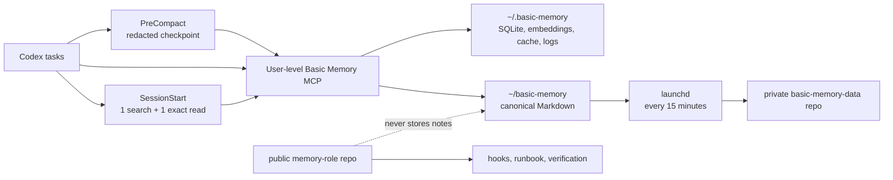

# memory-role

Hun의 macOS Codex task들이 하나의 로컬 [Basic Memory](https://github.com/basicmachines-co/basic-memory)를 자동으로 회상·기록하도록 만든 [공개 운영 저장소](https://github.com/hun99999/memory-role)입니다. 개인 메모리 데이터가 아니라 **설정 계약, version pin, token-bounded hook, 백업 스크립트, 검증 절차**만 공개 형상관리합니다.

## 최종 구조



- canonical Markdown: `~/basic-memory`
- 파생 상태: `~/.basic-memory`
- Codex 전역 연결: `~/.codex/config.toml`의 `mcp_servers.basic-memory`
- Codex lifecycle hook: `~/.codex/hooks.json`
- 기본 Basic Memory project: `main`
- 공개 Git 저장소: 이 폴더. 개인 note와 runtime state는 포함하지 않습니다.
- 비공개 Markdown backup: [hun99999/basic-memory-data](https://github.com/hun99999/basic-memory-data)

버전은 [versions.env](versions.env)에 고정했습니다. 현재 기준은 Basic Memory `0.22.1` / release `v0.22.1` / commit `232f4690656d7c93f39fc0cb13b0826243f2e0da`입니다. 근거는 [공식 release](https://github.com/basicmachines-co/basic-memory/releases/tag/v0.22.1)와 [공식 Codex 안내](https://docs.basicmemory.com/integrations/codex/)입니다.

## 선택한 연결 방식

standalone local MCP와 이 저장소의 작은 Python hook만 사용합니다.

- Codex 자체 Memories의 생성과 사용은 껐지만 기존 데이터는 삭제하지 않았습니다.
- Basic Memory MCP는 전역에 정확히 한 번 등록했습니다.
- MCP 도구는 `search_notes`, `read_note`, `write_note`, `edit_note`, `list_directory`, `list_memory_projects`만 허용합니다.
- Basic Memory의 background `auto_update`는 꺼서 설치 버전이 `versions.env`의 exact pin을 벗어나지 않게 했습니다.
- 공식 Basic Memory Codex plugin은 설치하지 않았습니다. 대신 검토 가능한 stdlib-only hook 2개만 사용자 전역으로 영구 신뢰했습니다.
- `SessionStart`는 repository slug로 검색 1회, 최대 3개 후보, exact read 1회만 수행합니다. 주입 문자열은 3,200자, Codex hook context는 1,200 token으로 이중 제한됩니다.
- `PreCompact`는 전체 transcript를 저장하지 않고 최대 2MB tail에서 최신 user/assistant excerpt를 추출·redact하여 Git pointer와 다음 action 하나만 기록합니다.
- Basic Memory cloud sync는 껐습니다. canonical Markdown은 별도 private GitHub remote로만 백업합니다.

Codex의 user/project 설정 계층과 MCP 설정 키는 [Codex Configuration Reference](https://learn.chatgpt.com/docs/config-file/config-reference#configtoml)를 따릅니다.

현재 설정의 재현 가능한 최소 조각은 [Codex MCP TOML 예시](config/codex-mcp.toml.example)와 [global AGENTS 규칙](config/global-agents-basic-memory.md)에 보관합니다. 실제 user config 전체는 다른 개인 설정이 섞여 있으므로 공개 저장소에 복사하지 않습니다.

## 평소 사용법

Hun은 별도 명령이나 “기억해”, “메모리 찾아봐”라는 말을 붙일 필요가 없습니다.

1. 새 Codex task를 평소처럼 해당 project 폴더에서 엽니다.
2. `SessionStart`가 repository의 `.codex/basic-memory.json`에 지정된 project를 사용하고, 없으면 `main`에서 repository slug를 한 번 검색합니다.
3. 관련 checkpoint/decision이 있으면 가장 최신 exact note 하나만 task context에 넣습니다.
4. Codex는 항상 현재 요청, `AGENTS.md`, branch/HEAD/diff/test/provider state를 다시 확인하며 memory가 현재 증거와 다르면 현재 증거를 따릅니다.
5. 의미 있는 결정·구현·검증 변화는 global rule에 따라 Codex가 간결한 note로 남기고, compaction 직전에는 hook이 마지막 pointer checkpoint를 보강합니다.

이미 열려 있던 task는 user-level hook을 다시 읽지 않을 수 있으므로 이 설정 이후 새로 여는 task부터 자동 경로가 보장됩니다. 관련 note가 전혀 없는 repository에서는 검색만 하고 context를 주입하지 않습니다.

## decision과 checkpoint

다음만 durable note로 자동 남깁니다.

- 이후 구현이 의존하는 결정과 supersede 관계
- 반복해서 잊기 쉬운 검증된 gotcha
- 의미 있는 구현·판정·검증 변화가 생긴 checkpoint

[decision 템플릿](templates/decision.md)과 [checkpoint 템플릿](templates/checkpoint.md)을 사용합니다. checkpoint는 pointer-first, 800단어 미만, 다음 primary action 하나만 기록합니다. trivial/중복/read-only 상태는 건너뜁니다. transcript, 전체 diff/source/log, secret, token, DB 접속정보는 저장하지 않습니다.

정확한 checkpoint로 재개하는 예:

```bash
bm tool read-note main/codex/setup/basic-memory-setup-verification-2026-08-15 \
  --project main --local
```

## 새로운 코드 repository 연결

project 이름이나 GitHub identity를 추측하지 않습니다.

```bash
git rev-parse --show-toplevel
git remote get-url origin
bm project list --json
```

별도 memory project가 실제로 필요할 때만 canonical note 전용 폴더를 코드 checkout 밖에 만들고 등록합니다. 코드 repository 자체를 Basic Memory project path로 사용하면 기존 Markdown을 인덱싱·수정할 수 있으므로 피합니다.

```bash
bm project add VERIFIED_PROJECT ~/basic-memory-projects/VERIFIED_PROJECT --local
```

그 뒤 [repository mapping 템플릿](templates/repository-basic-memory.json)을 대상 repository의 `.codex/basic-memory.json`으로 복사해 검증된 project 이름만 바꾸고, 대상 repository에서 다음을 실행합니다.

```bash
/absolute/path/to/memory-role/scripts/check-repository-link.sh
```

standalone MCP가 JSON을 직접 소비하는 것은 아닙니다. global `AGENTS.md`가 이 파일을 repository routing contract로 읽도록 구성되어 있습니다. 나중에 공식 plugin을 승인해 설치해도 같은 파일 형식을 재사용할 수 있습니다.

## Git 백업

이 공개 저장소는 운영 자산만 보관합니다. 개인 note는 [private `basic-memory-data`](https://github.com/hun99999/basic-memory-data)에만 push합니다.

`launchd` label `com.hun.memory-role.basic-memory-backup`이 login 시와 900초마다 [backup-memory.sh](scripts/backup-memory.sh)를 실행합니다.

- `.gitignore`와 `*.md`만 staging/commit할 수 있습니다.
- 마지막 Markdown 수정 후 60초가 지나지 않았으면 이번 회차를 건너뛰고 다음 15분 회차에서 다시 봅니다.
- secret signature, symlink Markdown, non-Markdown tracked file, 다른 branch/remote, Git operation, 기존 staged change가 있으면 자동 commit하지 않습니다.
- 새 변경을 push하기 직전에 GitHub API로 remote가 여전히 `PRIVATE`인지 다시 확인하며, 확인할 수 없으면 변경을 unstaged 상태로 보존합니다.
- 자동 `pull`, `reset`, `clean`, `stash`, `rebase`, conflict resolution, force-push는 없습니다.
- push가 실패해도 만든 local commit은 보존하고 오류를 `~/.basic-memory/git-backup.log`에 남깁니다.

즉시 수동으로 같은 안전 경로를 실행할 때만 다음을 사용합니다.

```bash
scripts/backup-memory.sh --force
```

## 검증

```bash
scripts/verify-local.sh
scripts/check-repository-link.sh
```

첫 스크립트는 version pin, native Memories 비활성화, MCP allowlist, trusted hook, bounded orientation, private remote visibility, Markdown allowlist, loaded 15-minute LaunchAgent, canonical/derived 분리를 확인합니다. 두 번째 스크립트는 현재 Git remote와 repository mapping, 실제 Basic Memory project 존재를 읽기 전용으로 확인합니다.

## 민감 정보

- Basic Memory는 local mode만 사용합니다.
- note에 credential, access token, API key, private payload를 넣지 않습니다.
- hook excerpt에는 흔한 token/key/password/private-key 패턴 redaction을 적용하지만, 민감 정보를 memory에 넣지 않는 규칙 자체를 대체하지 않습니다.
- `~/.basic-memory/config.json`은 `0600`, `~/.basic-memory`는 `0700`으로 유지합니다.
- `memory-role`은 공개 저장소이므로 machine-local report나 개인 note를 커밋하지 않습니다.

## upgrade

1. 최신 stable release와 changelog, Codex 호환성을 공식 저장소에서 확인합니다.
2. tag와 commit SHA를 확인한 뒤 exact version으로 설치합니다.
3. `versions.env`와 `SETUP_REPORT.md`를 함께 갱신합니다.
4. `scripts/verify-local.sh`와 새 MCP process search/read를 다시 실행합니다.

```bash
uv tool install --force 'basic-memory==X.Y.Z'
```

floating `main`, unpinned `uvx`, beta/nightly는 사용하지 않습니다.
upgrade 후 `~/.basic-memory/config.json`의 `auto_update`는 다시 `false`인지 확인합니다.

## rollback / uninstall

MCP만 제거하려면 다음을 실행합니다. note와 파생 DB는 보존됩니다.

```bash
codex mcp remove basic-memory
```

package까지 제거하려면:

```bash
uv tool uninstall basic-memory
```

설정 rollback은 [SETUP_REPORT.md](SETUP_REPORT.md)에 기록된 timestamp backup을 확인한 뒤 해당 파일을 복원합니다. `~/basic-memory`와 `~/.basic-memory` 삭제는 uninstall에 포함하지 않으며 별도 명시적 승인 없이는 수행하지 않습니다.

자동화만 끄려면 먼저 LaunchAgent를 unload하고 `~/.codex/hooks.json`을 제거하거나 `features.hooks=false`로 설정합니다. private repository와 local Markdown은 삭제하지 않습니다.

```bash
launchctl bootout "gui/$(id -u)" ~/Library/LaunchAgents/com.hun.memory-role.basic-memory-backup.plist
```
