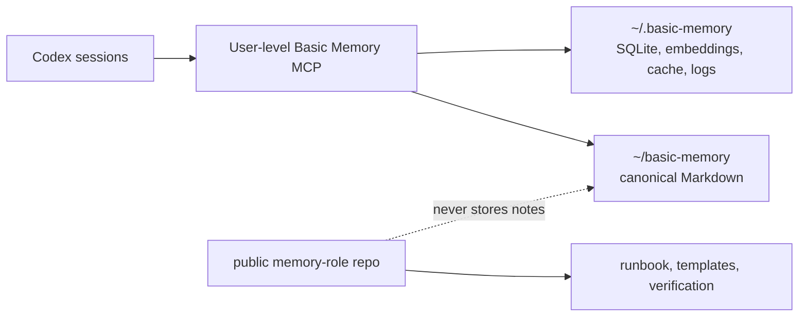

# memory-role

Hun의 macOS Codex 세션들이 하나의 로컬 [Basic Memory](https://github.com/basicmachines-co/basic-memory)를 선택적으로 공유하도록 만든 [공개 운영 저장소](https://github.com/hun99999/memory-role)입니다. 개인 메모리 데이터가 아니라 **설정 계약, 버전 핀, 템플릿, 검증 절차**만 형상관리합니다.

## 최종 구조



- canonical Markdown: `~/basic-memory`
- 파생 상태: `~/.basic-memory`
- Codex 전역 연결: `~/.codex/config.toml`의 `mcp_servers.basic-memory`
- 기본 Basic Memory project: `main`
- 공개 Git 저장소: 이 폴더. 개인 note와 runtime state는 포함하지 않습니다.

버전은 [versions.env](versions.env)에 고정했습니다. 현재 기준은 Basic Memory `0.22.1` / release `v0.22.1` / commit `232f4690656d7c93f39fc0cb13b0826243f2e0da`입니다. 근거는 [공식 release](https://github.com/basicmachines-co/basic-memory/releases/tag/v0.22.1)와 [공식 Codex 안내](https://docs.basicmemory.com/integrations/codex/)입니다.

## 선택한 연결 방식

standalone local MCP만 사용합니다.

- Codex 자체 Memories의 생성과 사용은 껐지만 기존 데이터는 삭제하지 않았습니다.
- Basic Memory MCP는 전역에 정확히 한 번 등록했습니다.
- MCP 도구는 `search_notes`, `read_note`, `write_note`, `edit_note`, `list_directory`, `list_memory_projects`만 허용합니다.
- Basic Memory의 background `auto_update`는 꺼서 설치 버전이 `versions.env`의 exact pin을 벗어나지 않게 했습니다.
- 공식 Codex plugin과 SessionStart/PreCompact hook은 설치하지 않았습니다. 자동 orientation과 transcript 기반 checkpoint가 매 세션 문맥을 늘리고 별도 hook 신뢰를 요구하기 때문입니다.
- cloud sync와 자동 Git backup도 켜지 않았습니다.

Codex의 user/project 설정 계층과 MCP 설정 키는 [Codex Configuration Reference](https://learn.chatgpt.com/docs/config-file/config-reference#configtoml)를 따릅니다.

현재 설정의 재현 가능한 최소 조각은 [Codex MCP TOML 예시](config/codex-mcp.toml.example)와 [global AGENTS 규칙](config/global-agents-basic-memory.md)에 보관합니다. 실제 user config 전체는 다른 개인 설정이 섞여 있으므로 공개 저장소에 복사하지 않습니다.

## 새 세션 시작

현재 대화와 repository 증거만으로 충분하면 memory를 조회하지 않습니다. 과거 결정이나 checkpoint가 다음 행동을 바꿀 때만 아래 순서를 한 번 수행합니다.

1. repository의 `.codex/basic-memory.json`이 있으면 `primaryProject`를 사용하고, 없으면 `main`을 사용합니다.
2. `search_notes`를 한 번 호출하며 결과는 최대 3개로 제한합니다.
3. 필요한 note 하나의 exact permalink만 `read_note`로 읽습니다.
4. 현재 사용자 요청, `AGENTS.md`, branch/HEAD/diff/test/provider 상태와 다시 대조합니다.

현재 이미 열린 Codex task는 새 MCP를 자동 재로딩하지 않을 수 있습니다. 별도로 연 fresh Codex CLI task에서는 MCP 검색과 exact read가 통과했으므로 이후 새 task부터 전역 MCP와 수정된 global `AGENTS.md`가 적용됩니다.

## decision과 checkpoint

다음만 durable note로 남깁니다.

- 이후 구현이 의존하는 결정과 supersede 관계
- 반복해서 잊기 쉬운 검증된 gotcha
- 의미 있는 구현·판정·검증 변화가 생긴 checkpoint

[decision 템플릿](templates/decision.md)과 [checkpoint 템플릿](templates/checkpoint.md)을 사용합니다. checkpoint는 pointer-first, 800단어 미만, 다음 primary action 하나만 기록합니다. transcript, 전체 diff/source/log, secret, token, DB 접속정보는 저장하지 않습니다.

정확한 checkpoint로 재개하는 예:

```bash
bm tool read-note main/codex/setup/basic-memory-setup-verification-2026-08-15 \
  --project main --local
```

## 새로운 코드 repository 연결

project 이름이나 GitHub identity를 추측하지 않습니다.

```bash
git rev-parse --show-toplevel
git remote get-url origin
bm project list --json
```

별도 memory project가 실제로 필요할 때만 canonical note 전용 폴더를 코드 checkout 밖에 만들고 등록합니다. 코드 repository 자체를 Basic Memory project path로 사용하면 기존 Markdown을 인덱싱·수정할 수 있으므로 피합니다.

```bash
bm project add VERIFIED_PROJECT ~/basic-memory-projects/VERIFIED_PROJECT --local
```

그 뒤 [repository mapping 템플릿](templates/repository-basic-memory.json)을 대상 repository의 `.codex/basic-memory.json`으로 복사해 검증된 project 이름만 바꾸고, 대상 repository에서 다음을 실행합니다.

```bash
/absolute/path/to/memory-role/scripts/check-repository-link.sh
```

standalone MCP가 JSON을 직접 소비하는 것은 아닙니다. global `AGENTS.md`가 이 파일을 repository routing contract로 읽도록 구성되어 있습니다. 나중에 공식 plugin을 승인해 설치해도 같은 파일 형식을 재사용할 수 있습니다.

## Git 백업

이 공개 저장소는 운영 자산만 백업합니다. `~/basic-memory`의 개인 note는 공개 remote로 push하지 않습니다.

canonical Markdown의 private GitHub backup은 현재 구성하지 않았습니다. 필요해지면 별도 private repository를 만든 뒤 visibility를 다시 확인하고, 수동 checkpoint commit/push부터 시작합니다. 자동 pull/reset/clean/stash/rebase/충돌 해결은 사용하지 않습니다. 자동 backup은 복잡성과 충돌 위험이 현재 이득보다 커서 보류했습니다.

## 검증

```bash
scripts/verify-local.sh
scripts/check-repository-link.sh
```

첫 스크립트는 버전, native Memories 비활성화, MCP 단일 등록과 도구 allowlist, project 경로, 설정 권한, note persistence, canonical/derived 분리를 확인합니다. 두 번째 스크립트는 현재 Git remote와 repository mapping, 실제 Basic Memory project 존재를 읽기 전용으로 확인합니다.

## 민감 정보

- Basic Memory는 local mode만 사용합니다.
- note에 credential, access token, API key, private payload를 넣지 않습니다.
- `~/.basic-memory/config.json`은 `0600`, `~/.basic-memory`는 `0700`으로 유지합니다.
- `memory-role`은 공개 저장소이므로 machine-local report나 개인 note를 커밋하지 않습니다.

## upgrade

1. 최신 stable release와 changelog, Codex 호환성을 공식 저장소에서 확인합니다.
2. tag와 commit SHA를 확인한 뒤 exact version으로 설치합니다.
3. `versions.env`와 `SETUP_REPORT.md`를 함께 갱신합니다.
4. `scripts/verify-local.sh`와 새 MCP process search/read를 다시 실행합니다.

```bash
uv tool install --force 'basic-memory==X.Y.Z'
```

floating `main`, unpinned `uvx`, beta/nightly는 사용하지 않습니다.
upgrade 후 `~/.basic-memory/config.json`의 `auto_update`는 다시 `false`인지 확인합니다.

## rollback / uninstall

MCP만 제거하려면 다음을 실행합니다. note와 파생 DB는 보존됩니다.

```bash
codex mcp remove basic-memory
```

package까지 제거하려면:

```bash
uv tool uninstall basic-memory
```

설정 rollback은 [SETUP_REPORT.md](SETUP_REPORT.md)에 기록된 timestamp backup을 확인한 뒤 해당 파일을 복원합니다. `~/basic-memory`와 `~/.basic-memory` 삭제는 uninstall에 포함하지 않으며 별도 명시적 승인 없이는 수행하지 않습니다.
